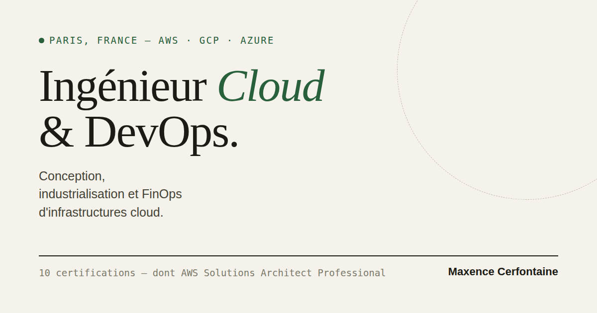

# Maxence Cerfontaine — Cloud & DevOps Portfolio

[Consulter le portfolio](https://maxence-cerfontaine.cloud/) · [LinkedIn](https://www.linkedin.com/in/maxence-cerfontaine)

[](https://maxence-cerfontaine.cloud/)

Portfolio professionnel bilingue de Maxence Cerfontaine, ingénieur Cloud & DevOps basé à Paris.

Le site présente mon parcours, mes missions et mes compétences autour d’AWS, GCP, Azure, Terraform, de l’industrialisation et du FinOps. Sa direction visuelle reprend les codes d’une fiche technique éditoriale : lisible, sobre et sans dépendance à un framework.

## Fonctionnalités

- contenu intégralement disponible en français et en anglais ;
- parcours professionnel sous forme de schéma d’architecture interactif ou de chronologie ;
- fiches détaillées par employeur et par mission ;
- mise en page responsive, du mobile au desktop ;
- navigation au clavier, états de focus visibles et prise en compte de `prefers-reduced-motion` ;
- téléchargement des CV français et anglais ;
- métadonnées Open Graph, sitemap, robots.txt et page 404 dédiée ;
- politique de confidentialité et mentions légales bilingues.

## Choix techniques

| Élément | Choix |
|---|---|
| Structure | HTML5 sémantique |
| Présentation | CSS natif, variables et breakpoints responsives |
| Interactions | JavaScript sans framework |
| Typographies | Fraunces, Archivo et IBM Plex Mono |
| Mesure d’audience | Cloudflare Web Analytics |
| Déploiement | Site statique |

Le projet ne nécessite ni compilation ni gestionnaire de paquets.

## Lancer le site localement

```bash
git clone https://github.com/Max-cfn/Portfolio.git
cd Portfolio
python3 -m http.server 8000
```

Le portfolio est ensuite accessible sur `http://localhost:8000`.

## Structure du dépôt

```text
Portfolio/
├── index.html                 # Portfolio et interactions
├── 404.html                   # Page d’erreur
├── confidentialite.html      # Politique de confidentialité
├── mentions-legales.html     # Mentions légales
├── assets/                    # Logos et ressources visuelles
├── cv/                        # CV français et anglais
├── robots.txt
├── sitemap.xml
├── site.webmanifest
└── og.png                     # Image de partage
```

## À propos

Ce dépôt contient uniquement le portfolio public et ses ressources. Les réalisations effectuées pour mes employeurs et clients sont décrites à un niveau compatible avec leurs exigences de confidentialité.

—

**Maxence Cerfontaine** · Ingénieur Cloud & DevOps  
[maxence-cerfontaine.cloud](https://maxence-cerfontaine.cloud/) · [GitHub](https://github.com/Max-cfn) · [LinkedIn](https://www.linkedin.com/in/maxence-cerfontaine)